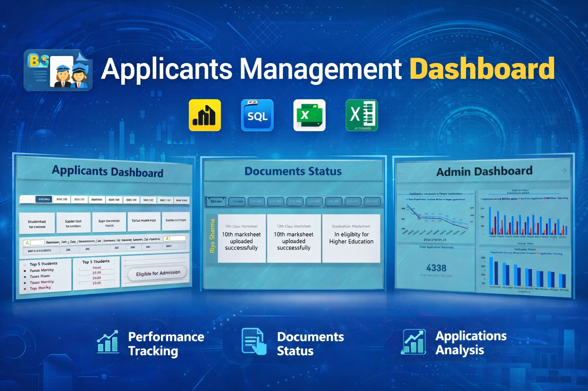
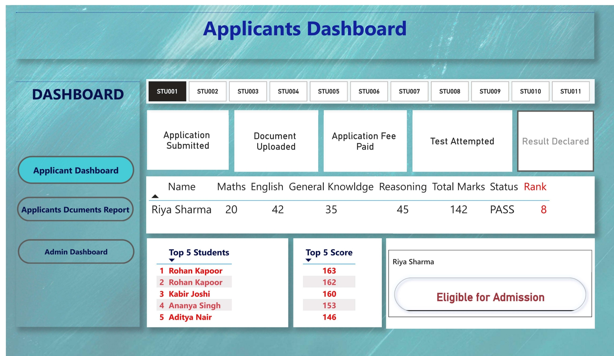
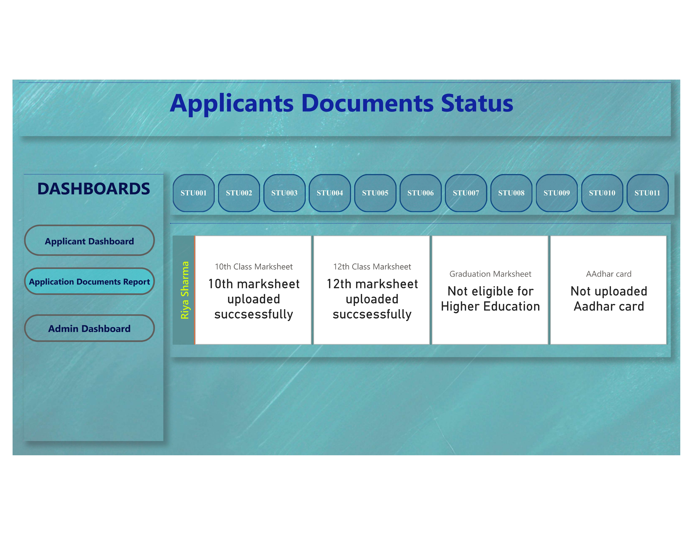
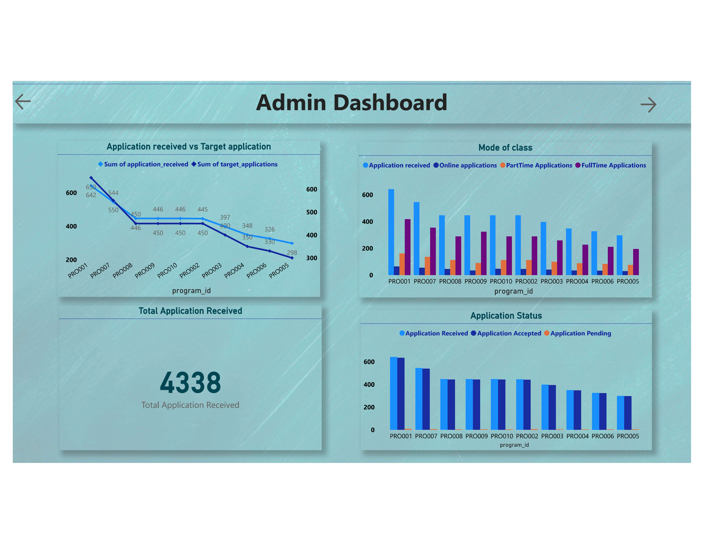
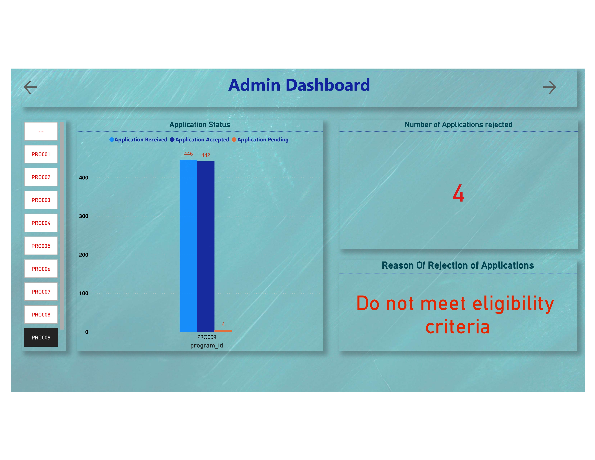
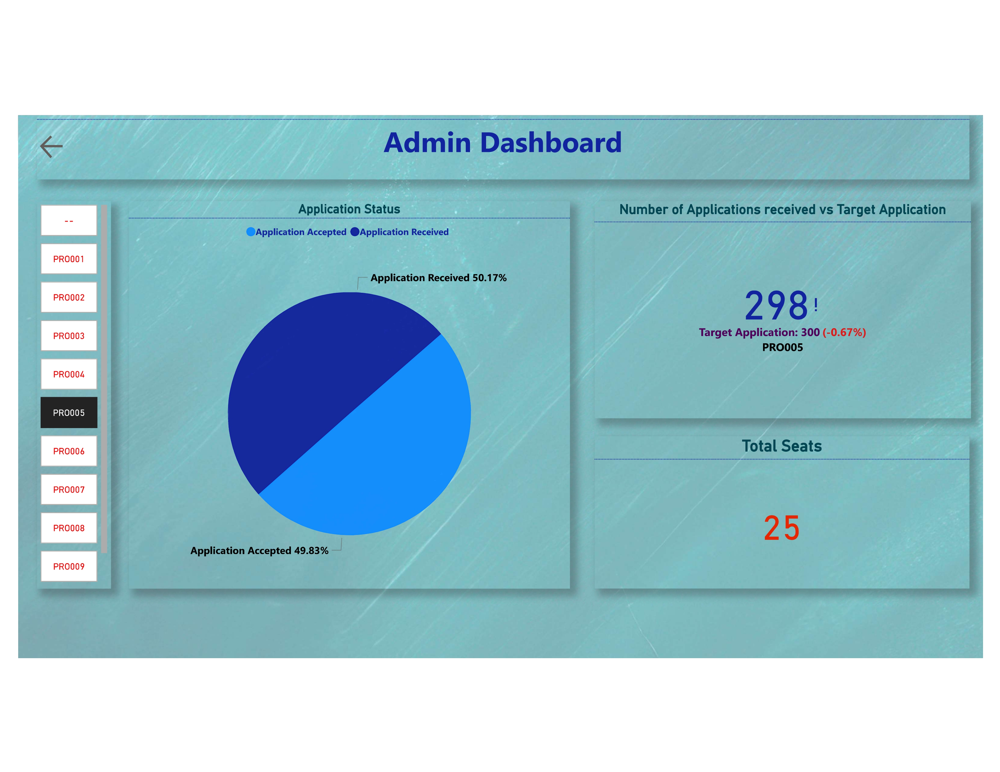

<h1 align="center">📊 Applicants Management Dashboard</h1>

  

  <b>Power BI + Excel + SQL  Data Analytics Project</b>

<h2>🚀 Project Overview</h2>

This project is a complete <b>Applicants Management System Dashboard</b> built using 
<b>Power BI</b>, <b>Excel</b>, and <b>SQL</b>. It helps track student applications, 
documents, performance, and administrative insights in a single platform.

<h2>🛠️ Technologies Used</h2>
<ul>
  <li><b>Power BI</b> – Interactive dashboards & visualization</li>
  <li><b>Excel</b> – Data collection & preprocessing</li>
  <li><b>SQL</b> – Data storage, queries & transformation</li>
</ul>

<h2>📊 Dashboard Preview</h2>

<h3>1️⃣ Applicants Dashboard</h3>

  

<ul>
  <li>✔ Application Status Tracking</li>
  <li>✔ Subject-wise Marks Analysis</li>
  <li>✔ Rank & Result System</li>
  <li>✔ Top 5 Students</li>
</ul>

<h3>2️⃣ Documents Status Dashboard</h3>

  

<ul>
  <li>✔ 10th / 12th Marksheet Status</li>
  <li>✔ Graduation Eligibility Check</li>
  <li>✔ Aadhaar Upload Tracking</li>
  <li>✔ Student-wise Document Monitoring</li>
</ul>

<h3>3️⃣ Admin Dashboard</h3>

  

<ul>
  <li>✔ Total Applications Overview</li>
  <li>✔ Application vs Target Analysis</li>
  <li>✔ Mode of Application (Online/Offline)</li>
  <li>✔ Application Status (Accepted/Pending)</li>
</ul>

  

  

<h2>🔄 Data Workflow</h2>

1️⃣ Data collected using Excel  
2️⃣ Stored & managed in SQL Database  
3️⃣ Data cleaned & transformed using SQL queries  
4️⃣ Connected to Power BI for visualization  
5️⃣ Interactive dashboards created for decision making

<h2>📌 Key Insights</h2>
<ul>
  <li>📈 Track student performance & rankings</li>
  <li>📄 Monitor document submission status</li>
  <li>📊 Analyze application trends</li>
  <li>🎯 Identify top students & eligibility</li>
</ul>

<h2>💡 Future Improvements</h2>
<ul>
  
  <li>🌐 Deploy dashboard on web</li>
  <li>⚡ Real-time database integration</li>
</ul>

<h2>⭐ Support</h2>

If you like this project, don’t forget to give it a ⭐ on GitHub!

